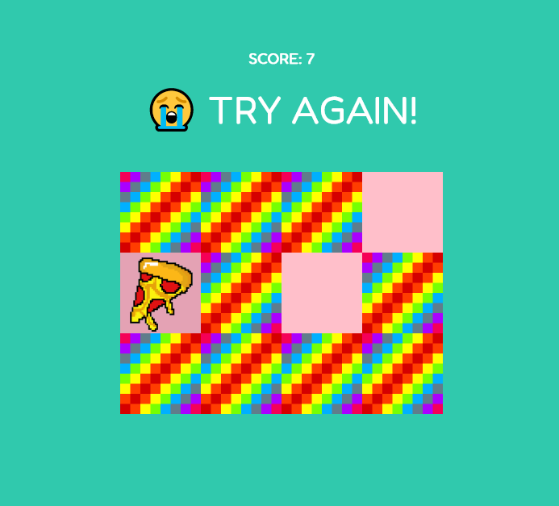

I followed a tutorial by the talented Ania Kubow, 
for me the purpose was to get familiar with/learn more about JS.

Modifications to improve UX: 
- re-shuffle the card array after all cards were found, so that user can continue with the game;

- disabled the "click" event on the matched cards so user cannot click on them to reveal the cards again; 

- aditional condition added to check the matching card function so that it would not count if user clicked on the same img with the same id.

- note on how to shuffle an array: 

```js
function shuffleArray(array) {
    for (let i = array.length - 1; i > 0; i--) {
        let j = Math.floor(Math.random() * (i + 1));
        let temp = array[i];
        array[i] = array[j];
        array[j] = temp;
    }
}
```


